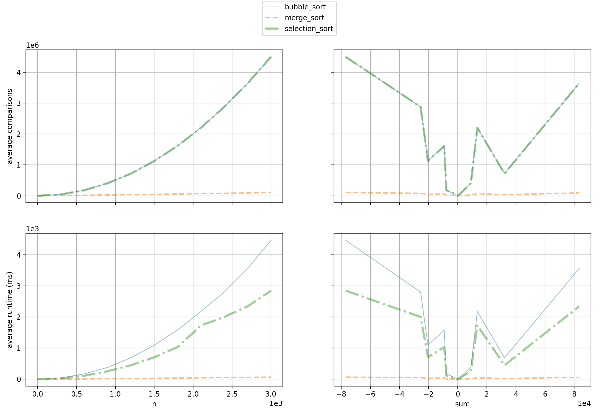

## This is a tiny piece of code to performance test your algorithms

The folder [algo](./algo) provides simple utility functions and a set of operations. One implement different algorithms solving some problem and compare them in terms of the computational complexity

To test that output value of each algorithm in **algorithms** for each input in **inputs** satisfies the **predicate**:

```python
def test(algorithms, inputs, predicate) -> None:
    ...
```

To show a graph showing how the value of each op in **operations** depends on each of the **weights** of each input in **inputs** for each algorithm in **algorithms**:

```python
def analyse(algorithms, inputs, weights, operations) -> None:
    ...
```

## Example

To check the example with sorting it just run the following command:

```sh
python sorting.py
```

This will show a graph like this:


